<h1 title="Hey! It's me, but i'm not Goku, I'm Bruno!">
  Oi, eu sou <del>Goku</del> Bruno! 👋
</h1>

<h2 title="Head of Data Engineering & AI | Software Engineering Specialist">
  🚀 Gerente de Engenharia de Dados & IA | Especialista em Engenharia de Software
</h2>

* Iniciei como **designer**, desenvolvendo resoluções criativas para impasses complexos. Evoluí para **analista de implantações**, aprimorando a capacidade de traduzir necessidades operacionais em soluções técnicas; e, como **consultor Protheus**, aprofundei-me em sistemas ERP, integrando processos de negócio à tecnologia.
* A transição para o **desenvolvimento de software** consolidou uma visão tática end-to-end, permitindo liderar projetos orientados a eficiência, escalabilidade e sustentabilidade técnica.
* Sou desenvolvedor sênior em **ADVPL** e **TL++**, pleno em **Python** e júnior em **React**, com forte atuação na **orquestração de Inteligências Artificiais** aplicadas a desenvolvimento, automação e **vibe coding**, o que me permite transitar com fluidez entre linguagens, arquiteturas e paradigmas.

> Atualmente, reporto ao CEO da SPSP (>8 mil colaboradores), liderando a transformação digital por meio da convergência entre **Engenharia de Dados**, **Inteligência Artificial** e **Estratégia de Negócios**.

  
<b>🌎 English version (About me)</b>

  <ul>
    <li>
      I started my career as a <strong>designer</strong>, solving complex problems creatively. I then moved into <strong>deployment analysis</strong>, translating operational needs into technical solutions; and later worked as a <strong>Protheus ERP consultant</strong>, deeply integrating business processes with technology.
    </li>
    <li>
      My transition into <strong>software development</strong> consolidated an end-to-end tactical vision, enabling me to lead projects focused on efficiency, scalability, and technical sustainability.
    </li>
    <li>
      I am a senior <strong>ADVPL/TL++</strong> developer, mid-level <strong>Python</strong> developer, junior <strong>React</strong> developer, and strong <strong>AI orchestrator</strong> for development, automation, and <em>vibe coding</em>.
    </li>
  </ul>

  <blockquote>
    Currently, I report directly to the CEO of SPSP (+8,000 employees), leading digital transformation through the convergence of <strong>Data Engineering</strong>, <strong>Artificial Intelligence</strong>, and <strong>Business Strategy</strong>.
  </blockquote>

---

<h3 title="Leadership • Data Engineering • ERP & Software Development • AI & Analytics">
  🧠 O que eu faço
</h3>

* **Liderança Estratégica:** Gestão de equipes multidisciplinares com metodologias **4DX** e **OKRs**.
* **Engenharia de Dados:** Arquitetura, governança e pipelines inteligentes para escalabilidade.
* **Dev & ERP:** Especialista em **ADVPL/TL++** e ecossistema **Protheus (TOTVS)**, com visão *end-to-end*.
* **Inovação & IA:** Integração de IA e Analytics para decisões preditivas e aumento de ROI.

---

<h3 title="Technology Stack & Tooling">
  🛠️ Caixa de ferramentas
</h3>

  Minha base é sólida, mas minha curiosidade é constante. Aqui estão as tecnologias que domino e as que utilizo para experimentação:

<h4 title="Core Technologies & Primary Expertise">
  <b>Core & Especialidade</b>
</h4>

<h4 title="Application Development & Web Technologies">
  <b>Desenvolvimento & Web</b>
</h4>

<h4 title="Infrastructure, Data & Systems Integration">
  <b>Infra, Dados & Integração</b>
</h4>

---

<h3 title="Business Domain Expertise (Protheus ERP)">
  💼 Domínio de Negócio (ERP Protheus)
</h3>

  Não é apenas código, é sobre entender o negócio. Possuo conhecimento profundo nos módulos:

`Compras` `Contábil` `Estoque` `Faturamento` `Financeiro` `Fiscal` `Gestão de Pessoas` `Loja` `Medicina e Segurança` `TAF`

---

<h3 title="Academic Background & Education">
  📚 Formação Acadêmica
</h3>

<ul>
  <li title="Bachelor's degree in Computer Engineering">
    🎓 <strong>Engenharia da Computação</strong> (Bacharelado)
  </li>
  <li title="Bachelor's degree in Information Technology with focus on Internet of Things">
    🎓 <strong>Tecnologia da Informação</strong> com ênfase em Internet das Coisas (Bacharelado)
  </li>
  <li title="Postgraduate specialization in Software Engineering">
    🎓 <strong>Engenharia de Software</strong> (Especialista)
  </li>
  <li title="Associate degree in Information Technology">
    🎓 <strong>Tecnólogo em Tecnologia da Informação</strong>
  </li>
  <li title="Associate degree in Database Technology">
    🎓 <strong>Tecnólogo em Banco de Dados</strong>
  </li>
  <li title="Project Management certification (Google & FATEC)">
    📜 <strong>Certificado Google & FATEC</strong> em Gestão de Projetos
  </li>
</ul>

---

<!-- MATRIX-START -->
<h3 title="Aggregated codebase size and recent evolution snapshot">
  🟩 A Matrix <small>(Ref. 14/12/2025)</small>
</h3>

<blockquote title="Total lines">
  ∑ Soma dos repositórios: <strong>6.820.764 linhas</strong>
</blockquote>

<h4 title="Lines added and removed across repositories in the last 10 days">
  Linhas nos últimos 10 dias
</h4>

- `spsp-plus`: Δ10d **+2.491** linhas (∑ **4.770.688**)  
  └── + 4.188 | - 1.697
- `spsp-site`: Δ10d **+0** linhas (∑ **1.894.496**)  
  └── + 0 | - 0
- `hybrid-codebase`: Δ10d **+2.055** linhas (∑ **103.970**)  
  └── + 3.230 | - 1.175
- `spsp-protheus`: Δ10d **+706** linhas (∑ **35.385**)  
  └── + 3.267 | - 2.561
- `spsp-plus-app`: Δ10d **+0** linhas (∑ **16.225**)  
  └── + 0 | - 0

   
  <em title="Loading Matrix...">A Matrix está carregando…</em>

<!-- MATRIX-END -->

<h4 title="Automated metrics generated and hosted via Heroku">
  📡 Sinais da Matrix via Heroku
</h4>

  

<h4 title="Snapshot view of GitHub metrics and activity">
  👁️‍🗨️ Olhando para metrics
</h4>

  

---

   

  <i>"Sou o elo entre sistemas e pessoas"</i>

